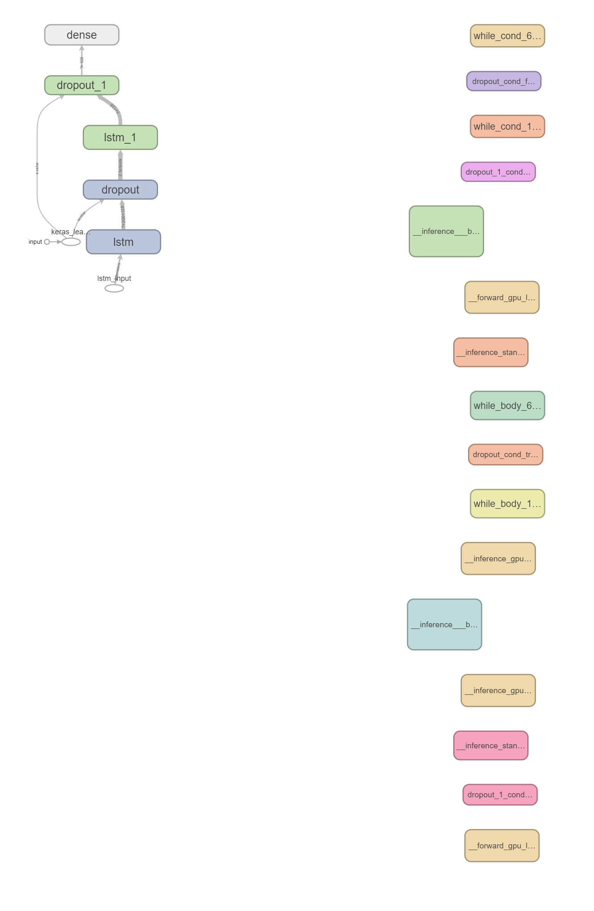

# Sentiment_Analysis
 Analyse review to determine the positivity or negativity of a text

# Description

# How to use it
clone repo and run it
sentiment_analysis_training.py is a script that train the data.
sentiment_analysis_deployment is for deployment purpose.

# Credits
Shoutout to Ankit152 for the data
check out his github repo at 
https://raw.githubusercontent.com/Ankit152/IMDB-sentiment-analysis/master/IMDB-Dataset.csv

# Code
'''

'''

